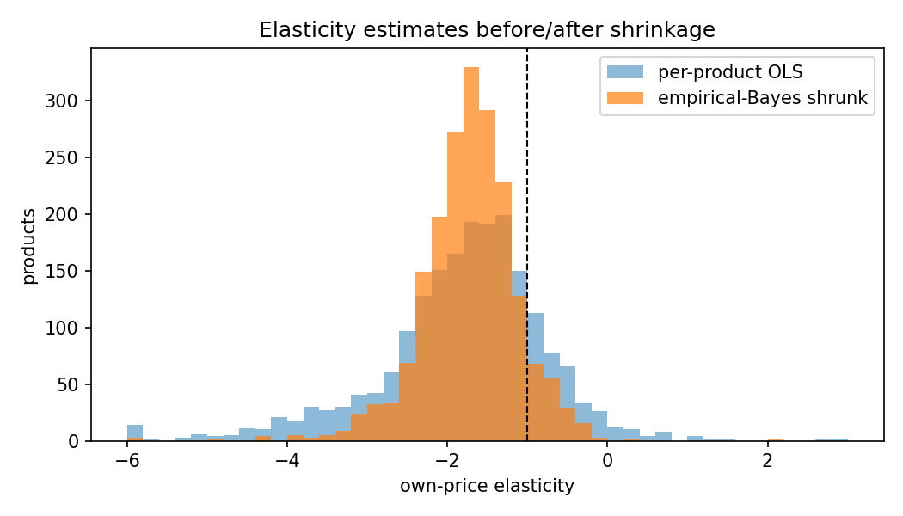

# Pricing & Experimentation Lab

> **Personal project.** Built independently in my own time with public data. It is not affiliated with, commissioned by, or derived from any employer, client or academic institution.

Statistical toolkit and end-to-end analysis for **pricing decisions**: where revenue concentrates, how
demand responds to price, and how to design a randomized price test that can actually detect the effect.

Built on the public [UCI Online Retail II](https://archive.ics.uci.edu/dataset/502/online+retail+ii) dataset
(~1M transaction lines, UK online retailer, 2009-2011) with **SQL (DuckDB)** for data preparation and
**Python (statsmodels, SciPy)** for modeling.

## Questions answered

| Question | Method | Result (see [reports/RESULTS.md](reports/RESULTS.md)) |
|---|---|---|
| Which products matter? | Pareto analysis | 21% of products generate 80% of revenue |
| How price-sensitive is demand? | Log-log fixed-effects regression, clustered SEs | Elasticity ≈ -1.55 (95% CI -1.60 to -1.51) |
| Which per-product estimates can we trust? | Empirical-Bayes (random-effects) shrinkage | Noisy estimates pulled toward the portfolio mean |
| How big must a price test be? | Power analysis + CUPED on real customer spend | CUPED cuts the required sample by ~45% |
| Is the test design valid? | Simulated A/A and A/B tests | A/A false-positive rate 5.0% |



## A note on bias

The first model used the *average price paid* per week and gave an elasticity of -2.03. That estimate is
biased: bulk orders receive volume discounts, so weeks with large orders mechanically show a lower average
price. Switching to the weekly *median list price* reduces that reverse-causality channel and gives -1.55.
Both numbers are reported, and the estimates are used to **prioritize which products to test**, not as final
causal effects. The experimentation module is the tool for the causal answer.

## Structure

```
sql/                      DuckDB views: cleaning, product-week panel, customer periods
src/pricing_lab/
  data.py                 download + Parquet conversion + DuckDB session
  pareto.py               revenue concentration
  elasticity.py           fixed-effects elasticity, per-product OLS (HC3), empirical-Bayes shrinkage
  experiments.py          Welch t-test, two-proportion z-test, sample size, bootstrap CI, CUPED, power simulation
scripts/run_analysis.py   end-to-end pipeline -> reports/RESULTS.md + figures
tests/                    unit tests (known-answer and simulation checks)
```

## Run it

```bash
pip install -r requirements.txt
python scripts/run_analysis.py   # downloads the dataset (~45 MB) on first run
pytest -q
```

## Author

Manuel Alejandro Polo González · [LinkedIn](https://www.linkedin.com/in/manuel-alejandro-p-339754118)
