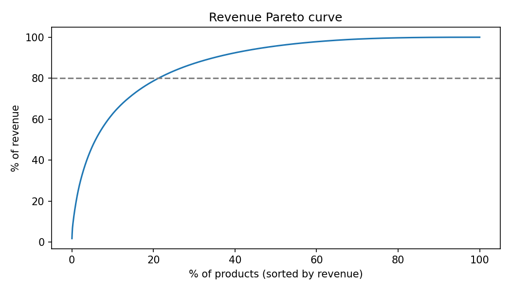

# Results

Generated by `python scripts/run_analysis.py` on the UCI Online Retail II dataset (Dec 2009 - Dec 2011).

## 1. Revenue concentration (Pareto)

- 4,873 products; the top **1,035 (21.2%)** generate 80% of revenue.
- Elasticity work below focuses on products with enough history and price variation.

## 2. Price elasticity

- Panel: 139,239 product-weeks, 1958 UK products with >= 40 weeks and real list-price variation.
- Naive model on *average price paid*: -2.03. This is biased: bulk orders get volume discounts, so a big week mechanically lowers the average price (reverse causality from quantity to price).
- Using the weekly *median list price* instead: **-1.55** (95% CI -1.60 to -1.51, within-product, month seasonality, SE clustered by product).
- Per-product estimates are noisy; empirical-Bayes shrinkage toward mu = -1.72 (between-product sd tau = 0.79).
- After shrinkage, 91% of products look elastic (beta < -1): price cuts there are more likely to raise revenue.
- These are observational associations (prices move with order size and promotions). Use them to **prioritize** which products to test, not as final causal estimates.

## 3. Experiment design: how many customers does a price test need?

- Outcome: customer spend Jun-Aug 2011 (2,809 customers); covariate: spend Mar-May 2011.
- CUPED (theta = 0.68) removes **45%** of outcome variance.
- To detect a 5% lift in spend (80% power, alpha 5%): **19,833** customers per arm without CUPED vs **10,979** with CUPED.
- Simulated A/A tests with CUPED: false-positive rate 5.8% (target 5%).
- Simulated 10% lift on the real customer base: power 27% without CUPED vs 47% with CUPED.
- Note: the lift in these simulations is injected; the purpose is to size and validate the test design before running it.
